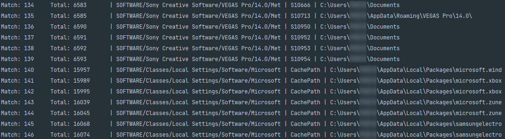

# Registry Updater

This script is created to solve issue happened on 2020.12.27 when Win10 Edu generated non-latin User folder.  
Definitely many programs was not happy about this.

After converting folder name and changing primary account registry, there were still tons of more registries to edit.  
Thus, creating python script to iterate, identify and fix all previous User folder name to new folder name.

This script will recursively identify all keys with *target* keyword in it.

There is no safety feature in this, use with caution!
